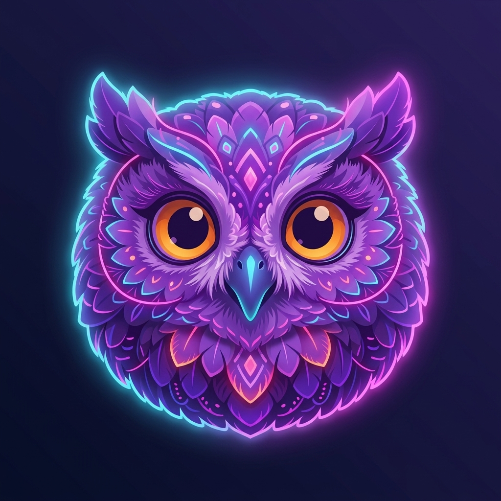

<p align="center">
  
</p>

<h1 align="center">Lumina Quiz</h1>

<p align="center">
  <strong>A Gamified Flutter Quiz & Productivity Experience</strong>
</p>

<p align="center">
  
  
  
  
  
  
  
</p>

<p align="center">
  
  
  
  
  
  
  
  
  
</p>

---

## 📖 About

**Lumina Quiz** is a gamified learning and productivity platform crafted using Flutter. Designed with an offline-first philosophy, it leverages a local SQLite database and SharedPreferences for seamless user sessions and progress persistence. Empowered by Provider state management, it offers users a highly responsive and visually stunning experience complete with interactive character companions, customizable themes, virtual economies, achievements, and real-time statistics.

* 📱 **Beautiful UI**: Modern glassmorphic elements and curated, HSL-tailored dark color palettes.
* 🦉 **Character Companions**: Unlockable assistants that level up as you gain experience points.
* 🗄️ **Offline First**: All progress, settings, and quiz history are saved locally.

---

## ✨ Features

| Feature | Description | Icon |
| :--- | :--- | :---: |
| **Quiz Engine** | Custom multiple-choice engine with real-time feedback and score counters. | 🎮 |
| **Categories** | Structured learning domains covering Programming, Tech, Aptitude, Geography, and more. | 🧠 |
| **Achievements** | Multi-tiered system rewarding milestone accomplishments. | 🏆 |
| **Virtual Coins** | Earned through active learning, used to unlock premium features. | 💰 |
| **Dynamic Themes** | Equip dynamic, animated backgrounds with custom overlays. | 🎨 |
| **Focus Buddies** | Interactive companions (Owls) with distinct level-up capabilities. | 🦉 |
| **XP & Leveling** | Level progression based on quiz completion and accuracy. | 📈 |
| **In-Game Shop** | Unlock new avatars, companions, and premium screen themes. | 🛍️ |
| **Detailed Statistics** | Visual summary of performance history, accuracy, and levels. | 📊 |
| **Quiz History** | Track detailed histories of previous quiz attempts. | 📚 |
| **Offline Engine** | Zero dependency on remote APIs for gameplay and logic. | ⚡ |
| **Dark UI** | Eye-friendly, glassmorphic layout tailored for night/dark modes. | 🌙 |
| **Local SQL Db** | High-performance query engine using SQLite. | 💾 |
| **Daily Rewards** | Daily sign-in coin and XP bonuses. | 🎯 |

---

## 📱 Screenshots

<table align="center">
  <tr>
    <td><br/><p align="center">Splash Screen</p></td>
    <td><br/><p align="center">Onboarding</p></td>
    <td><br/><p align="center">Login</p></td>
    <td><br/><p align="center">Signup</p></td>
  </tr>
  <tr>
    <td><br/><p align="center">Home</p></td>
    <td><br/><p align="center">Categories</p></td>
    <td><br/><p align="center">Quiz Playing</p></td>
    <td><br/><p align="center">Quiz Result</p></td>
  </tr>
  <tr>
    <td><br/><p align="center">Profile</p></td>
    <td><br/><p align="center">Shop</p></td>
    <td><br/><p align="center">Settings</p></td>
    <td><br/><p align="center">Statistics</p></td>
  </tr>
</table>

---

## 🎥 Demo

<details>
  <summary>🎬 Click to view Gameplay Demo & Media</summary>
  <br/>
  <p align="center">
    
  </p>
  <p align="center">
    <a href="https://youtube.com/placeholder">📺 Watch full video review on YouTube</a>
  </p>
</details>

---

## 🏗 Architecture

Lumina Quiz is built using the **MVVM (Model-View-ViewModel)** architectural pattern coupled with the **Repository Pattern** to decouple the user interface from data retrieval:

```
┌────────────────────────────────────────────────────────┐
│                        VIEW                            │
│           (Widgets / Screens / Layouts)                │
└───────────────────────────┬────────────────────────────┘
                            ▼
┌────────────────────────────────────────────────────────┐
│                     VIEWMODEL                          │
│         (Providers: AppState, ThemeManager, Shop)      │
└───────────────────────────┬────────────────────────────┘
                            ▼
┌────────────────────────────────────────────────────────┐
│                     REPOSITORY                         │
│       (AuthRepository, CharacterRepository)            │
└───────────────────────────┬────────────────────────────┘
                            ▼
┌────────────────────────────────────────────────────────┐
│                     DATA LAYER                         │
│       (DatabaseHelper, SharedPreferences, JSON)       │
└────────────────────────────────────────────────────────┘
```

* **Providers**: Coordinate reactive state updates across the app (Themes, User Coins, XP, levels).
* **Database Helper**: Handles schema creation, upgrades, and transactions for the SQLite repository.
* **Services**: Encapsulate business logic (e.g., character upgrades, quiz computations).

---

## 📂 Project Structure

```
softskills_assignment/
├── .github/
│   └── workflows/
│       └── build_apk.yml        # CI/CD release workflow
├── android/                     # Android specific config
├── ios/                         # iOS specific config
├── downloads/                   # Pre-compiled release packages
├── assets/                      # Application assets
│   ├── Theme/                   # Theme backgrounds & overlays
│   └── images/                  # Game characters, coins, and icons
├── lib/
│   ├── data/                    # JSON and local raw data sets
│   ├── database/                # SQLite helper and service scripts
│   ├── models/                  # Data structures (User, Quiz, Theme, Companion)
│   ├── providers/               # ViewModels / State Providers
│   ├── repositories/            # Data orchestration layer
│   ├── screens/                 # Mobile layouts and main modules
│   ├── services/                # Local logic services
│   ├── utils/                   # Style definitions and constants
│   ├── widgets/                 # Reusable glassmorphic UI components
│   └── main.dart                # Application bootstrap
└── pubspec.yaml                 # Package config and resources
```

---

## ⚙ Tech Stack

| Technology | Layer | Purpose |
| :--- | :--- | :--- |
| **Flutter** | Framework | Cross-platform UI development |
| **Dart** | Programming Language | App core and business logic |
| **SQLite** | Database | Local relational data persistence |
| **Provider** | State Management | Dependency injection and view binding |
| **SharedPreferences** | Key-Value Storage | Session tokens, theme settings, flags |
| **Material 3** | Design System | Standard components and styling tokens |
| **HTTP** | Networking | Fetching external details if needed |
| **Connectivity Plus** | Network State | Verifying network capabilities |
| **GitHub Actions** | Automation | Automated build and release pipelines |

---

## 🚀 Installation

Follow these instructions to run Lumina Quiz locally:

```bash
# 1. Clone the repository
git clone https://github.com/krishflutter993/softskills_assignment.git

# 2. Navigate to the project root
cd softskills_assignment

# 3. Pull required packages
flutter pub get

# 4. Launch on connected device
flutter run

# 5. Build localized APKs
flutter build apk --split-per-abi

# 6. Build App Bundle for Play Store
flutter build appbundle
```

---

## 📥 Download APK

Pre-compiled, architecture-specific release binaries are available for direct download below:

| Architecture | Description | Download |
| :--- | :--- | :---: |
| 📱 **ARM64** | Optimized for modern 64-bit devices (most current phones). | [📥 Download APK](https://github.com/krishflutter993/softskills_assignment/releases/latest/download/app-arm64-v8a-release.apk) |
| 📱 **ARMv7** | Compatible with older 32-bit Android smartphones. | [📥 Download APK](https://github.com/krishflutter993/softskills_assignment/releases/latest/download/app-armeabi-v7a-release.apk) |
| 💻 **x86_64** | Tailored for emulator runs and x86_64 compatible architectures. | [📥 Download APK](https://github.com/krishflutter993/softskills_assignment/releases/latest/download/app-x86_64-release.apk)|

---

## 🤖 CI/CD

Our automated pipeline is driven by GitHub Actions (`.github/workflows/build_apk.yml`):
* **Build Validation**: Automatically runs on pushes and Pull Requests targeting the `main` branch to guarantee compile-time integrity.
* **Architecture Splitting**: Generates separate APKs tailored to `ARM64`, `ARMv7`, and `x86_64` to minimize asset bloat.
* **Auto-Release**: Creates a draft/tagged GitHub Release and uploads all three APK binaries when a release tag (e.g. `v*`) is pushed.

---

## 🗄️ Database

Lumina Quiz relies on an efficient, local relational storage engine powered by SQLite:

* **Users Table**: Manages profiles, XP, level state, and cumulative performance scores.
* **Quiz History Table**: Preserves detailed logs of finished quiz challenges (scores, counts, date).
* **Coins Table**: Tracks earned and spent balance transactions.
* **Themes Table**: Identifies which themes have been purchased vs. equipped.
* **Characters Table**: Stores unlocked focus buddies and companion levels.
* **Achievements Table**: Logs achievements, completed steps, and award states.
* **Settings Table**: Preserves interface volume, voice settings, and alert states.

---

## 🎮 Gameplay

1. **Answer & Learn**: Select an educational category, answer questions correctly, and build streak metrics.
2. **Collect Rewards**: Earn **Coins** and **XP** for matching correct options and completing daily reward milestones.
3. **Level Up**: Amass XP to level up your user profile and unlock restricted shop assets.
4. **Upgrade Focus Buddies**: Purchase unique companion characters (Focus Owls) using coins, and level them up.
5. **Personalize**: Spend accumulated coins in the shop to buy premium, animated screen backdrops.

---

## 📊 Roadmap

- [ ] 👥 Multiplayer Duels (1v1 Live Quiz Challenges)
- [ ] 🏆 Global Leaderboard (Live rankings with friends)
- [ ] ☁️ Cloud Sync (Synchronize profiles using remote datastores)
- [ ] 💾 Firebase Backup (Secure account creation and backups)
- [ ] 🤖 AI Quiz Generator (Create custom quizzes from prompts)
- [ ] 📅 Daily Challenges (Time-bound special quests)
- [ ] 📱 Tablet Support (Responsive grid configurations)
- [ ] 🌐 Web Version (Fully compiled, responsive web app deployment)

---

## 🤝 Contributing

Contributions are welcome! Please follow these guidelines:

1. **Fork** the Repository.
2. **Create a Feature Branch** (`git checkout -b feature/AmazingFeature`).
3. **Commit** your Changes (`git commit -m 'feat: Add some AmazingFeature'`).
4. **Push** to the Branch (`git push origin feature/AmazingFeature`).
5. **Open a Pull Request** for code review.

---

## 🐞 Report Issues

For bugs, feature requests, or queries, please open a GitHub issue at:
👉 **[Report Issue Link](https://github.com/krishflutter993/softskills_assignment/issues)**

---

## 📄 License

Distributed under the **MIT License**. See `LICENSE` for more information.

---

## 👨‍💻 Author

<p align="left">
  <strong>Krish Savaliya</strong><br/>
  🔗 GitHub Profile: <a href="https://github.com/krishflutter993">@krishflutter993</a>
</p>

---

<p align="center">
  ⭐ If you like this project, please consider starring the repository.<br/>
  Made with ❤️ using Flutter.
</p>
